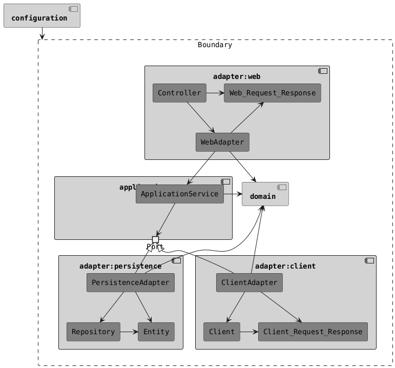

# HoCATLing 🐾

HoCATLing，Hands-on Clean Architecture Template Ling，即可落地的整洁架构模板轻量级版本，基于 [HoCAT](https://github.com/macdao/hands-on-clean-architecture-template)，适用于小型项目。

## 📋 需求文档

本项目实现了"要吃饱"订餐系统的订单管理功能。详细需求规格请参考：

📄 [需求文档](docs/Requirements.md)

---

## 🏗️ 架构设计

### 设计原则

- **简化项目结构**：不拆分多个独立的组件，所有代码在单一模块中组织
- **六边形架构**：应用层定义端口接口，适配器实现端口，遵循依赖倒置原则（DIP）
- **适用场景**：适合小型项目和快速原型开发，同时保持良好的架构边界

### 架构图


<details>
<summary>查看 PlantUML 源码</summary>



</details>

### 分层说明

| 层级 | 职责 | 示例组件 |
|------|------|---------|
| **adapter:web** | 处理 HTTP 请求和响应 | Controller, WebAdapter, Request/Response |
| **application** | 业务逻辑编排 | ApplicationService, Ports |
| **adapter:persistence** | 数据持久化 | Repository, Entity, PersistenceAdapter |
| **adapter:client** | 外部服务调用 | Client, ClientAdapter |
| **domain** | 领域模型和业务规则 | Domain Objects |
| **configuration** | 应用配置和依赖注入 | Spring Configuration |

---

## 🚀 快速开始

### 前置条件

#### 最低要求

| 组件 | 版本要求 | 说明 |
|------|---------|------|
| **Java** | 21+ | 必需，用于编译和运行应用 |
| **Gradle** | 8.x+ | 自动包含（使用 Gradle Wrapper） |

#### 可选组件

| 组件 | 用途 | 何时需要 |
|------|------|---------|
| **Docker** | 运行 MySQL 容器 | 使用 MySQL 模式时 |
| **Docker Compose** | 管理容器编排 | 使用 MySQL 模式时 |

### 本地运行测试

#### 模式 1：H2 内存数据库（推荐）

**适用场景**：快速开发、功能测试、演示

```bash
# 启动应用
./gradlew bootRun

# 访问 H2 控制台（可选）
# 浏览器打开: http://localhost:8080/h2-console
# JDBC URL: jdbc:h2:mem:testdb
# User: sa, Password: (留空)
```

#### 模式 2：MySQL 数据库

**适用场景**：集成测试、生产环境模拟、数据持久化需求

```bash
# 启动应用（自动启动 MySQL 容器）
./gradlew bootRun --args='--spring.profiles.active=mysql'

# 查看 MySQL 数据（可选）
docker exec -it app-mysql-1 mysql -u root testdb
```

**Docker Compose 配置**：
- 配置文件：`app/compose.yaml`
- 镜像：`mysql:lts`
- 数据库：`testdb`
- 端口：动态映射

---

## 🔨 构建和打包

### 编译项目

```bash
# 编译 Java 代码
./gradlew compileJava

# 编译测试代码
./gradlew compileTestJava
```

### 运行测试

```bash
# 运行所有测试
./gradlew test

# 运行契约测试
./gradlew contractTest

# 查看测试报告
open app/build/reports/tests/test/index.html
```

### 构建项目

```bash
# 完整构建（编译 + 测试 + 打包）
./gradlew build

# 跳过测试的构建
./gradlew build -x test
```

### 打包 Docker 镜像

```bash
# 使用 Spring Boot Gradle 插件构建镜像
./gradlew bootBuildImage

# 指定镜像名称和标签
./gradlew bootBuildImage --imageName=hocatling:latest

# 查看构建的镜像
docker images | grep hocatling
```
